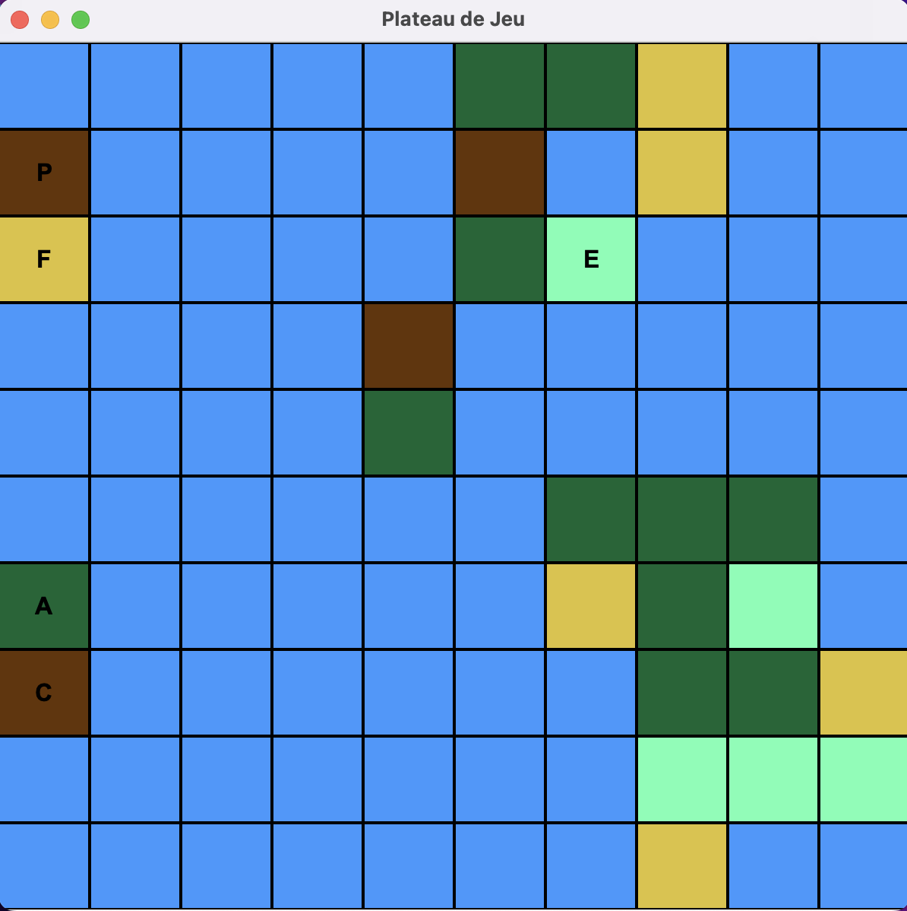

# l2s4-projet-2025

Vous devez *forker* ce projet dans votre espace de travail Gitlab (bouton `Fork`) et vidéo sur le [portail](https://www.fil.univ-lille.fr/portail/index.php?dipl=L&sem=S4&ue=Projet&label=Documents)
Un unique fork doit être réalisé par équipe.

Une fois cela réalisé, supprimer ces premières lignes et remplissez les noms des membres de votre équipe.
N'oubliez pas d'ajouter les autres membres de votre équipe aux membres du projet, ainsi que votre enseignant·e (statut Maintainer).

# Equipe

- Ahmed SYLLA
- Anas CHEBBI
- Hamza NADIFI

# Sujet

[Le sujet 2025](https://www.fil.univ-lille.fr/~varre/portail/l2s4-projet/sujet2025.pdf)

# Livrables

Les paragraphes concernant les livrables doivent être rempli avant la date de rendu du livrable. A chaque fois on décrira l'état du projet par rapport aux objectifs du livrable. Il est attendu un texte de plusieurs lignes qui explique la modélisation choisie, et/ou les algorithmes choisis et/ou les modifications apportées à la modélisation du livrable précédent.

Un lien vers une image de l'UML doit être fourni (une photo d'un diagramme UML fait à la main est suffisant).

## UML
https://lucid.app/lucidchart/7054f712-50b3-4e10-b6b1-dec0da30ec03/edit?viewport_loc=-11%2C-11%2C2219%2C1048%2C0_0&invitationId=inv_59b50eb4-21e7-436e-b32d-8b2cb42cb428

## Livrable 1
- Commande pour creer uniquement le Jar:
```bash
Make jar
```
- Commande pour exécuter  uniquement le Jar:
```bash
Make run_jar
```
- Commandes pour compiler et exécuter via le Jar(afficher le Plateau):
```bash
Make
```
- Commandes pour supprimer les fichier compilés et le Jar:
```bash
Make clean
```
### Atteinte des objectifs

Pour le premier livrable, nous avons travaillé sur la **modélisation du plateau de jeu** et la **gestion des tuiles** et des **ressources**.

Les objectifs atteints :

1. Structure du plateau :

- Création de la classe `Plateau` permettant de représenter le plateau de jeu sous la forme d'une grille de dimensions personnalisées à la creation du plateau.
- Mise en place d'une méthode d'initialisation du plateau où toutes les tuiles sont de type Mer par défaut.
- Ajout d'une méthode pour **générer aléatoirement les tuiles** du plateau tout en respectant les contraintes spécifiées dans le sujet :
    - Au moins 2/3 des tuiles doivent être de type `Mer`.
    - Les tuiles non Mer doivent être adjacentes à au moins une autre tuile non Mer.

2. Gestion des types de tuiles et des ressources:

- Création des classes spécifiques pour les différents types de tuiles : `Champ`, `Foret`, `Montagne`, `Paturage`, et `Mer`.
- Chaque type de tuile est associé à une ressource spécifique via une énumération `enumRessource`.

3. Affichage du plateau :

- Mise en place d'une méthode `display` dans la classe `Plateau` permettant un affichage visuel du plateau de jeu dans la console.
- Les tuiles sont représentées par leurs initiales (ou par les deux premières lettres pour éviter les ambiguïtés).

4. La classe **Main**:

- Création d'une classe `Main` pour tester l'initialisation, la génération des tuiles, et l'affichage du plateau.

5. Organisation et structure du projet :

- Organisation des fichiers sources dans des packages distincts (`plateau`, `tuile`, `type_tuile`,`ressource`,`batiment`).
- Mise en place d'un Makefile pour la compilation, l'exécution, et la génération d'un fichier `L2S4-Projet-2025.jar` exécutable.
- Implémentation des tests pour les méthodes des classes Plateau et Tuile, afin de valider leur bon fonctionnement et leur conformité avec les contraintes du sujet.

### Difficultés restant à résoudre

## Livrable 2

- Commande pour génerer la JavaDoc:

```bash
Make javadoc
```

- Commande pour creer uniquement le Jar:

```bash
Make jar
```

- Commande pour exécuter  uniquement le Jar:

```bash
Make run_jar
```

- Commandes pour compiler et exécuter via le Jar(afficher le Plateau):

```bash
Make
```

- Commandes pour compiler et exécuter les tests unitaires:

```bash
Make test
```

- Commandes pour supprimer les fichier compilés et le Jar et la JavaDoc:

```bash
Make clean
```

### Atteinte des objectifs

Pour le deuxième livrable, nous avons travaillé sur la **modélisation des batiments** 

Les objectifs atteints :

1. Modélisation des différents types de **Batiment**:

    - Une classe abstraite `Batiment`, qui représente une instance du **Batiment** et regroupe plusieurs attributs comme `type`, `dimension`et `tuile` et plusieurs méthodes comme `getType()`, `getDimension()` , et `getCout()`.

    - Une classe `Port`, `Ferme`, `Exploitation`, `Camp`, `Armee` , qui héritent de la class `Batiment` et qui contient un attribut `cout`, et une méthode `peutEtreConstruit`, et qui permet de vérifier si la tuile où on veut construire ce batiment respecte les conditions nécessaires.

2. Un programme principal (nommé `Livrable2.java`):

    - Ce programme principal permet de:
        - Créer un plateau aléatoire dont la taille **(largeur x hauteur)** est fournie en argument sur la ligne de commande et affiche sa représentation avec une condition du fait que le plateau sera de largueur minimale **10** et de hauteur minimale **10**.
        - Créer 5 batiments (`Port`,`Ferme`,`Exploitation`,`Camp`,`Armee`), tout en respectant les conditions de construction de chaque type de batiment.
        - Afficher le plateau de jeu dans le terminale grace à la méthode `display`
        - Afficher l'emplacement de chaque batiment installé.
        - Afficher le coût de construction de chaque batiment.
        - Afficher les ressources récoltées pour l'ensemble des tuiles possédant un bâtiment.
        - Afficher le plateau de jeu dans une fenêtre Swing.

3. Une class `PlateauSwing`:

    - Cette class nous a permet de :
        - Afficher le plateau de jeu sous forme graphique, en représentant chaque tuile par une couleur spécifique selon son type.
        - Afficher la première lettre du bâtiment placé sur chaque tuile contenant un batiment.

4. Tests unitaires:

    - Implémentation des tests pour les méthodes des classes `Batiment`, `Port`, `Ferme`, `Exploitation`, `Camp`, `Armee`, afin de valider leur bon fonctionnement et leur conformité avec les contraintes du sujet.

Résultats obtenus après éxecution de la commande `make test`:
```bash
╷
├─ JUnit Jupiter ✔
│  ├─ FermeTest ✔
│  │  ├─ testFermeCout() ✔
│  │  ├─ testForetCreation() ✔
│  │  └─ testFermePeutEtreConstruit() ✔
│  ├─ ArmeeTest ✔
│  │  ├─ testArmeeCout() ✔
│  │  └─ testArmeeCreation() ✔
│  ├─ PaturageTest ✔
│  │  └─ testPaturageConstructor() ✔
│  ├─ ChampTest ✔
│  │  └─ testChampConstructor() ✔
│  ├─ MerTest ✔
│  │  └─ testMerConstructor() ✔
│  ├─ CampTest ✔
│  │  ├─ testCampPeutEtreConstruit() ✔
│  │  └─ testCampCreation() ✔
│  ├─ PlateauTest ✔
│  │  ├─ testGenererTuiles() ✔
│  │  └─ testPlateauInitialiseAvecMer() ✔
│  ├─ TuileTest ✔
│  │  ├─ testGetAdjacents() ✔
│  │  ├─ testGetType() ✔
│  │  └─ testSetAdjacents() ✔
│  ├─ ExploitationTest ✔
│  │  ├─ testExploitationCout() ✔
│  │  └─ testExploitationCreation() ✔
│  ├─ BatimentTest ✔
│  │  ├─ testGetTuile() ✔
│  │  ├─ testGetCout() ✔
│  │  ├─ testGetDimension() ✔
│  │  └─ testSetDimension() ✔
│  ├─ MontagneTest ✔
│  │  └─ testMontagneConstructor() ✔
│  ├─ PortTest ✔
│  │  ├─ testPortCreation() ✔
│  │  ├─ testPortPeutEtreConstruit() ✔
│  │  └─ testPortCout() ✔
│  └─ ForetTest ✔
│     └─ testForetConstructor() ✔
├─ JUnit Vintage ✔
└─ JUnit Platform Suite ✔

Test run finished after 45 ms
[        16 containers found      ]
[         0 containers skipped    ]
[        16 containers started    ]
[         0 containers aborted    ]
[        16 containers successful ]
[         0 containers failed     ]
[        26 tests found           ]
[         0 tests skipped         ]
[        26 tests started         ]
[         0 tests aborted         ]
[        26 tests successful      ]
[         0 tests failed          ]
```
5. Organisation et structure du projet :

- Organisation des fichiers sources dans des packages distincts (`batiment`, `type_batiment`).
- Modification du Makefile pour la compilation et l'éxcution des tests, la géneration de la `javaDoc` et la génération d'un fichier `Livrable2.jar` exécutable.

Résultats obtenus après éxecution de la commande `make`:

```bash
hamzanadifi@MacBook-Pro-de-Hamza l2s4-projet-2025 % make
mkdir -p classes
javac -d classes src/plateau/Plateau.java src/ressource/Ressource.java src/batiment/type_batiment/Exploitation.java src/batiment/type_batiment/Port.java src/batiment/type_batiment/Camp.java src/batiment/type_batiment/Armee.java src/batiment/type_batiment/Ferme.java src/batiment/Batiment.java src/tuile/type_tuile/Montagne.java src/tuile/type_tuile/Champ.java src/tuile/type_tuile/Mer.java src/tuile/type_tuile/Paturage.java src/tuile/type_tuile/Foret.java src/tuile/Tuile.java src/main/PlateauSwing.java src/main/Main.java src/main/Livrable2.java
jar cfe Livrable2.jar main.Livrable2 -C classes .
java -jar Livrable2.jar
Entrez la largeur du plateau: 10
Entrez la hauteur du plateau: 10
      0     1     2     3     4     5     6     7     8     9  
   +-----+-----+-----+-----+-----+-----+-----+-----+-----+-----+
 0 | Me  | Me  | Me  | Me  | Me  |  F  |  F  |  C  | Me  | Me  |
   +-----+-----+-----+-----+-----+-----+-----+-----+-----+-----+
 1 | Mo  | Me  | Me  | Me  | Me  | Mo  | Me  |  C  | Me  | Me  |
   +-----+-----+-----+-----+-----+-----+-----+-----+-----+-----+
 2 |  C  | Me  | Me  | Me  | Me  |  F  |  P  | Me  | Me  | Me  |
   +-----+-----+-----+-----+-----+-----+-----+-----+-----+-----+
 3 | Me  | Me  | Me  | Me  | Mo  | Me  | Me  | Me  | Me  | Me  |
   +-----+-----+-----+-----+-----+-----+-----+-----+-----+-----+
 4 | Me  | Me  | Me  | Me  |  F  | Me  | Me  | Me  | Me  | Me  |
   +-----+-----+-----+-----+-----+-----+-----+-----+-----+-----+
 5 | Me  | Me  | Me  | Me  | Me  | Me  |  F  |  F  |  F  | Me  |
   +-----+-----+-----+-----+-----+-----+-----+-----+-----+-----+
 6 |  F  | Me  | Me  | Me  | Me  | Me  |  C  |  F  |  P  | Me  |
   +-----+-----+-----+-----+-----+-----+-----+-----+-----+-----+
 7 | Mo  | Me  | Me  | Me  | Me  | Me  | Me  |  F  |  F  |  C  |
   +-----+-----+-----+-----+-----+-----+-----+-----+-----+-----+
 8 | Me  | Me  | Me  | Me  | Me  | Me  | Me  |  P  |  P  |  P  |
   +-----+-----+-----+-----+-----+-----+-----+-----+-----+-----+
 9 | Me  | Me  | Me  | Me  | Me  | Me  | Me  |  C  | Me  | Me  |
   +-----+-----+-----+-----+-----+-----+-----+-----+-----+-----+
Port placé sur M(0, 1)
Ferme placée sur C(0, 2)
Armée placée sur F(0, 6) avec 5 guerriers
Camp placé sur M(0, 7)
Exploitation placée sur P(6, 2)

Coût des bâtiments :
Port: {Moutons=2, Bois=1}
Ferme: {Bois=1, Minerai=1}
Exploitation: {Moutons=1, Bois=2, Ble=1}
Armée: {Moutons=1, Bois=1, Ble=1}
Camp: {Bois=2, Minerai=3}

Ressources récoltées par les bâtiments placés :
Tuile (0, 1) produit : 1 Minerai
Tuile (0, 2) produit : 1 Ble
Tuile (0, 6) produit : 1 Bois
Tuile (0, 7) produit : 2 Minerai
Tuile (6, 2) produit : 2 Moutons
```
Fenêtre Swing affichée:



### Difficultés restant à résoudre

## Livrable 3

### Atteinte des objectifs

### Difficultés restant à résoudre

## Livrable 4

### Atteinte des objectifs

### Difficultés restant à résoudre

# Journal de bord

Le journal de bord doit être rempli à la fin de chaque séance encadrée, et avant de quitter la salle. 

Pour chaque semaine on y trouvera :
- ce qui a été réalisé, les difficultés rencontrées et comment elles ont été surmontées (on attend du contenu, pas uniquement une phrase du type "tous les objectifs ont été atteints")
- la liste des objectifs à réaliser d'ici à la prochaine séance encadrée

## Semaine 1

### Ce qui a été réalisé
LePlateau ainsi que l'algorithme de création on été fait, une abstract class Tuile qui représente les tuiles ainsi que les types de tuile qui en héritent.
Une class Batiment ainsi qu'une class ressource ont été creer pour représenté les ressources et les batiments.
### Difficultés rencontrées
- Le display pour l'instant il marche et affiche bien le Plateau avec le type de chaque tuile mais après qu'on aura à afficher le nom du joueur dans la tuile ça va pas marché parce que y aura des décalages, donc à modifier après.

### Objectifs pour la semaine

- avancement sur l'uml
- création de la class Plateau
- création de la class Tuile
- création des class de Type de Tuile
- Implémentation de l'algorithme de création du plateau
## Semaine 2

### Ce qui a été réalisé
Après une réflexion sur le diagramme UML, nous avons conclu qu'il est nécessaire de créer
 une classe énumération (enum) pour représenter les différents types de ressources.
 Nous avons également modifié la classe Forêt afin qu'elle soit mieux compatible avec les autres classes

### Difficultés rencontrées
Pendant la séance, l'adaptation du reste du code du projet à cette classe d'énumération était floue, 
et le diagramme UML n'était pas à jour par rapport au reste du code
### Objectifs pour la semaine
Il s'agit de mettre à jour le diagramme UML, 
d'adapter la classe Ressource au reste du code, et d'intégrer efficacement la classe d'énumération
## Semaine 3

### Ce qui a été réalisé
Mise à jour du diagramme UML en tenant compte des modifications mise en place dans l'algorithme.
Reflexion sur la classe abstraite Batiment pour savoir s'il s'agit d'un heritage de tuile ou non ( cette reflexion sera peaufinée) dans le livrable 2.
Mise en place des methodes de test.

### Difficultés rencontrées

reflexion encore sur la representation de la classe 
abstrait Batiment 

### Objectifs pour la semaine
Mettre à jour le diagramme UML,
Créer les methodes de test

## Semaine 4

### Ce qui a été réalisé
-Capture d'écran de UML realise pour le livrable 1 et ajout dans le projet
-Reflexion sur comment générer le plateau avec des arguments entrés par l'utilisateur

### Difficultés rencontrées
- Plateau de taille standard, qui est problématique lorsque l'utilisateur voudra changer la taille pour des eventuels besoins.
-Ereur dans le test TestGenererTuile(de la classe plateau)
### Objectifs pour la semaine
- Reflexion sur la création des batiments pour les differents jeux
- Resolution des probèmes évoqués

## Semaine 5

### Ce qui a été réalisé
- Après avoir fait plusieurs modifications majeurs dans l'algorithme de création du plateau dans la classe `Plateau`, on choisit de revenir à l'ancienne approche qu'on avait avant en récupérant un ancienne commit contenant l'ancienne version de l'algorithme, on créer une nouvelle branche appelé `branche`, on a fusionner les deux branche `main` et `branche` en gardant que ce qui dans la branche `branche`.
- On a implémenter les deux classe `Exploitation` et `camp` héritant de `Batiment` avec :
    - Une méthode `getCout()` pour chacune des deux classes et permettant de récupérer le cout de constuction du batiment concerné.
    - Une méthode `peutEtreConstruit` pour chacune des deux classes et permettant de vérifier la contrainte du fait que une `exploitation`peut etre construite que dans une tuile contenant déjà une `Ferme` et un `camp` peut etre construite que dans une tuile contenant déjà une `Armee`.
### Difficultés rencontrées

### Objectifs pour la semaine

## Semaine 6
-Mettre à jour de UML
-Mettre à jour de l'algorithme tenant compte de l'ancien algorithme
-Créer du livrable 2 et des classe Exploitation, Armée, Camp
-Adaptater des classes Champ, Paturage, Foret, Montagne

### Ce qui a été réalisé
-mise à jour de UML
-mise à jopur de l'algorithme tenant compte de l'ancien algorithme
-création du livrable 2 et des classes Exploitation, Armée, Camp
-Adaptation des classes Champ, Patrurage, Foret, Montagne

### Difficultés rencontrées

### Objectifs pour la semaine
-créer une classe PlateauSwing
-Réaliser les methodes de test pour le livrable 2
-mettre à jour UML

## Semaine 7

### Ce qui a été réalisé
- Reflexions des deux approches differentes
- choix de l'une de nos approche en tenant compte de `Listchooser`
- Reflexion sur les differentes classes abstraites
- Reflexion sur des classes qui vont heriter de la classe abstraite Action
### Difficultés rencontrées
- choix d'une approche, car deux jeux differents
### Objectifs pour la semaine
- Création de la classe abstraite `Game`.
- Création de la classe `Ares`.
- Création de la classe `Demeter`.
- Création de la classe abstraite `Action`.
- Création des differentes classes représentant les actions des deux jeux et qui héritent de `Action`.
- Création de la classe `Player`.
- Réflexion sur l'implémentation des `Listchooser`.
- Réflexion sur l'adaptation des `Listechooser` avec les reste des classes des action (Limiter l'accès de chaque action dans le jeu associé).
- Mise à jour UMl
## Semaine 8

### Ce qui a été réalisé
- Création des classes livrable3ares, livrable3demeter et actionAres
- 

### Difficultés rencontrées

### Objectifs pour la semaine
- Mise à jour de l'UML
- Codage des classes livrable3ares, livrable3demeter et actionsdemeter
- Creation des classes de test


## Semaine 9

### Ce qui a été réalisé

### Difficultés rencontrées

### Objectifs pour la semaine

## Semaine 10

### Ce qui a été réalisé

### Difficultés rencontrées

### Objectifs pour la semaine

## Semaine 11

### Ce qui a été réalisé

### Difficultés rencontrées

### Objectifs pour la semaine

## Semaine 12

### Ce qui a été réalisé

### Difficultés rencontrées

### Objectifs pour finaliser le projet